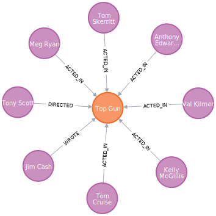
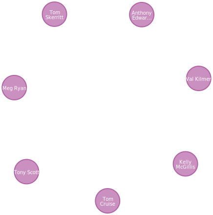
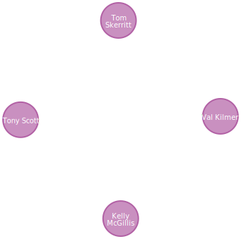
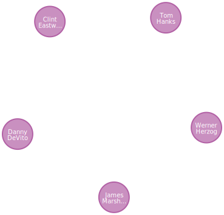
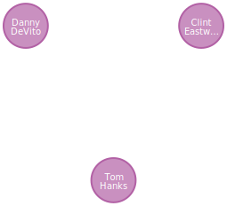
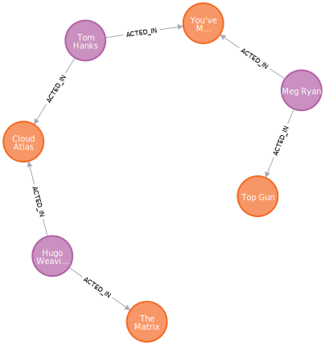

# TP3

Les exercices se trouvent dans [le fichier PDF mis à disposition](./TP.pdf).

On utilise la documentation situé à `:guide movie-graph` pour effectuer ces exercices.

## 1. Afficher le titre de tous les films

```
MATCH (m:Movie) RETURN m.title
```

| m.title                |
|------------------------|
| The Matrix             |
| The Matrix Reloaded    |
| The Matrix Revolutions |
| ...                    |

## 2. Afficher le film dont le titre est Top Gun. Visualisez le résultat en mode graphe, puis cliquez sur le nœud et activez l’option qui vous permet d’afficher les nœuds liés.

```
MATCH (m:Movie {title: "Top Gun"}) RETURN m
```



## 3. Afficher avec une requête la même information que celle que vous avez obtenue ci-dessus avec l’interface graphique, c’est-à-dire la liste de toutes les personnes associées au film Top Gun

```
MATCH (m:Movie {title: "Top Gun"})<-[:ACTED_IN|DIRECTED]-(p) RETURN p
```



## 4. Limiter la requête précédente aux personnes qui sont nées avant 1960.

```
MATCH (m:Movie {title: "Top Gun"})<-[:ACTED_IN|DIRECTED]-(p) WHERE p.born < 1960 RETURN p
```



## 5. Afficher toutes les personnes qui ont à la fois été actrices et réalisatrices (pas nécessairement dans le même film)

```
MATCH (p:Person)-[:ACTED_IN]->(:Movie) WHERE (p)-[:DIRECTED]->(:Movie) RETURN p
```



## 6. Afficher toutes les personnes qui ont été actrices d’un film qu’elles ont réalisé.

```
MATCH (p:Person)-[:ACTED_IN]->(m:Movie) WHERE (p)-[:DIRECTED]->(m) RETURN p
```



## 7. Rechercher le plus court chemin entre le film Top Gun et le film The Matrix.

```
MATCH path = shortestPath((m1:Movie {title: "Top Gun"})-[*]-(m2:Movie {title: "The Matrix"})) RETURN path
```



## 8. Modifier la requête précédente pour que votre chemin n’utilise que des relations de type ‘a joué dans’.

```
MATCH path = shortestPath((m1:Movie {title: "Top Gun"})-[:ACTED_IN*]-(m2:Movie {title: "The Matrix"})) RETURN path
```


## 9. Afficher toutes les personnes qui ont joué dans strictement plus de 5 films. Faites afficher le nom des personnes et le nombre de films.

```
MATCH (p:Person)-[:ACTED_IN]->(m:Movie) WITH p, count(m) AS nbMovies WHERE nbMovies > 5 RETURN p.name, nbMovies
```

| p.name          | nbMovies |
|-----------------|----------|
| Keanu Reeves    | 7        |
| Tom Hanks       | 12       |

## 10. En partant de la requête 8, ajoutez une contrainte sur les nœuds du plus court chemin : on veut que les nœuds de type `Person` ait une année de naissance (born) strictement supérieure à 1950.

```
MATCH path = shortestPath((m1:Movie {title: "Top Gun"})-[:ACTED_IN*]-(m2:Movie {title: "The Matrix"})) WHERE all(n IN nodes(path) WHERE NOT n:Person OR n.born > 1950) RETURN path
```


